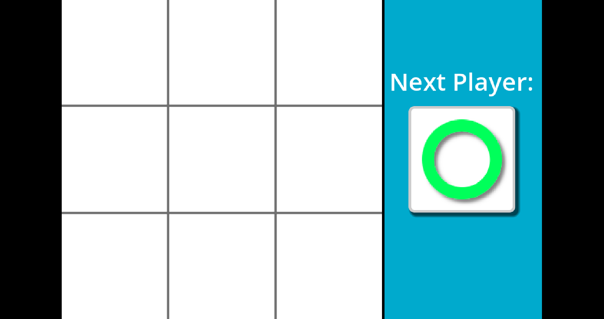
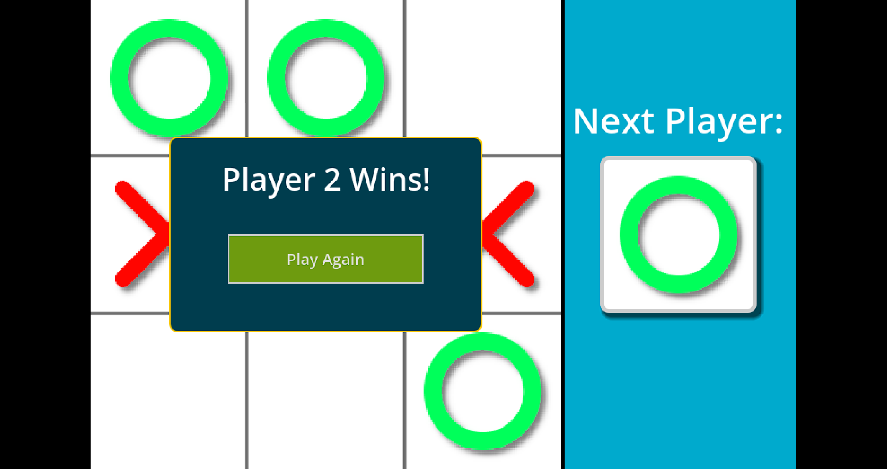
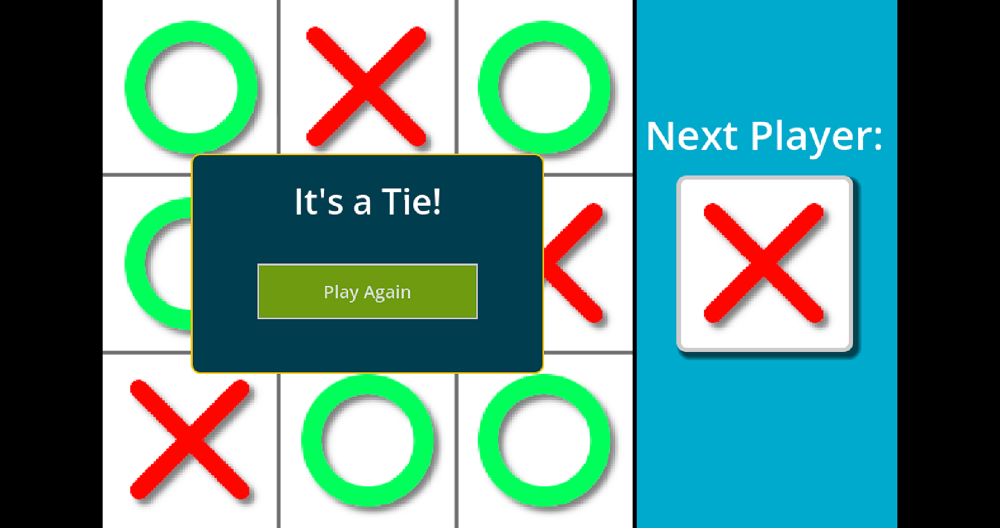

---
# :star: Tic Tac Toe 2D
A simple and fun Tic-Tac-Toe game implemented in Godot Engine. This project is designed for anyone who wants to play a classic game of Tic-Tac-Toe, either for entertainment or as a learning example of game development in Godot.

# :camera: Screenshots

# :sparkles: Features
- Two-player gameplay
- Simple and intuitive interface
- Visual indicators for player's turn
- Displays game over messages with results (win/tie)
- Restart game functionality

# :hammer_and_wrench: Stack used

**Front-end:** Godot Engine
	
# :books: Reference
- [Coding With Russ](https://www.youtube.com/watch?v=w6leMEr1aGo)

# :busts_in_silhouette: Authors
- [@imbiel-dev](https://www.github.com/imbiel-dev)
